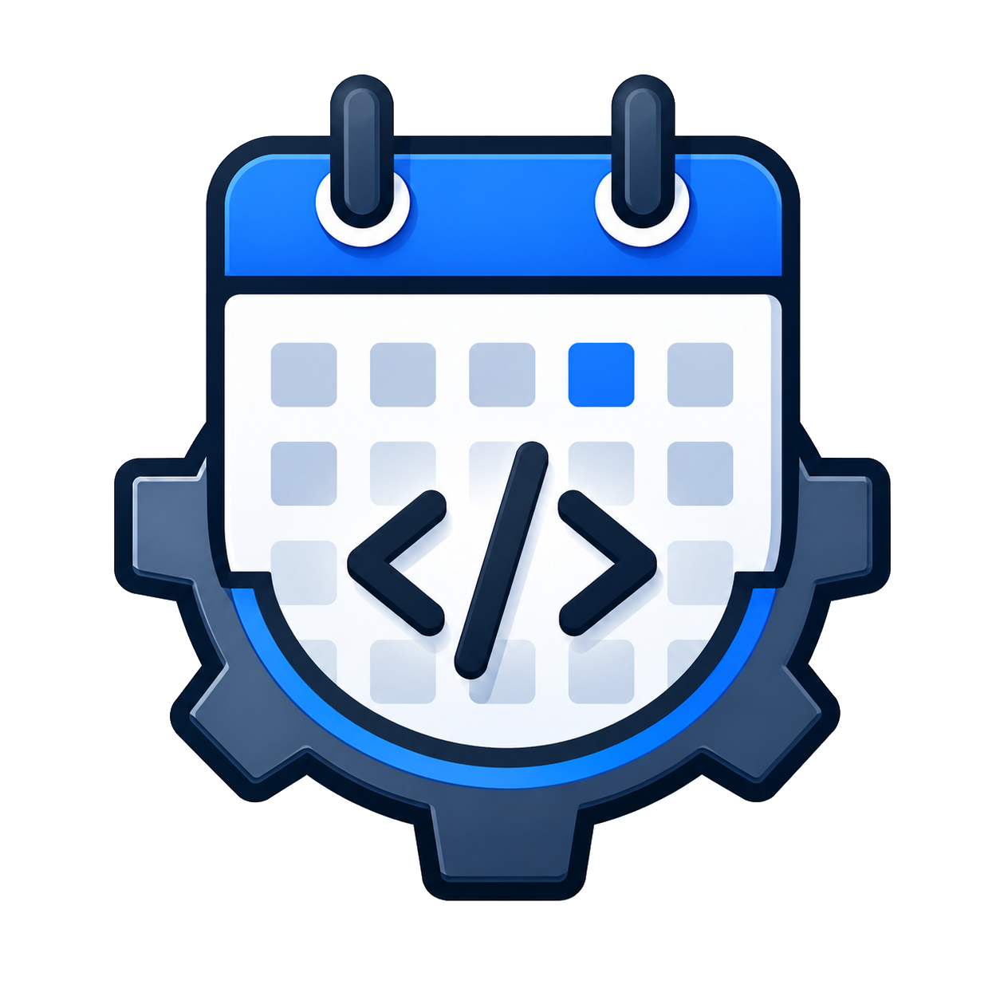

# Tech Events Tracker

 

**Live site: [techevents.tanay.tech](https://techevents.tanay.tech/)**

[](https://github.com/tanayseven/tech-events-tracker/actions)
[](https://techevents.tanay.tech)
[](https://github.com/tanayseven/tech-events-tracker/blob/main/LICENSE)
[](https://www.python.org/)
[](https://flask.palletsprojects.com/)
[](https://scrapy.org/)
[](https://docs.pydantic.dev/)
[](https://aws.amazon.com/s3/)
[](https://www.anthropic.com/)

Tracks ~100 tech conferences and meetups across India and internationally, populates event data via AI-assisted web scraping, and serves a searchable static webpage.

## How it works

1. **Scrapy** fetches each event website listed in `events_list.yaml`.
2. **Claude** (`claude-sonnet-4-6`) receives the raw HTML and extracts structured event data as JSON.
3. Results are validated with Pydantic and upserted into `event/<year>.yaml`.
4. **Flask + Frozen-Flask** reads the YAML and renders a responsive static HTML page.

## Setup

Requires [mise](https://mise.jdx.dev/) and [uv](https://docs.astral.sh/uv/).

```bash
mise install       # installs uv
uv sync            # installs Python dependencies into .venv
```

## Usage

### Fetch / refresh event data

```bash
export ANTHROPIC_API_KEY=sk-ant-...
uv run python main.py
```

Equivalent via the Scrapy CLI:

```bash
uv run scrapy crawl events
```

Re-running is safe — it upserts managed event entries and leaves any manually added entries untouched.

### Run the dev server

```bash
uv run python app.py
```

Open `http://localhost:5000`.

### Build static site

```bash
uv run python app.py freeze
```

Output goes to `build/`.

## Tracked events

`events_list.yaml` is the source of truth. It currently covers ~100 events across:

| Category | Examples |
|---|---|
| India-specific | PyCon India, GopherCon India, PyConF Hyderabad, India FOSS, Nullcon, Rootconf, JSFoo, ReactFoo |
| Cloud / DevOps | KubeCon, DockerCon, PlatformCon, DevOpsDays, SREcon, GrafanaCON |
| Major tech company | AWS re:Invent, Google Cloud Next, Google I/O, Microsoft Build, Microsoft Ignite, WWDC |
| Security | Black Hat, DEF CON, RSA Conference, USENIX Security, NDSS, CRYPTO |
| AI / ML | NeurIPS, ICML, ICLR, KDD, Data + AI Summit, ODSC |
| Systems / OS / DB | USENIX ATC, OSDI, SOSP, SIGMOD, VLDB, CIDR |
| Language communities | PyCon US, EuroPython, RustConf, GopherCon, CppCon, KotlinConf, JavaOne |
| Frontend / JS | React Summit, JSConf, ng-conf, Vue.js Amsterdam, Frontend Nation |
| Hardware / Embedded | Embedded World, CES, DAC, Electronica, Maker Faire |
| Networking | SIGCOMM, IEEE INFOCOM, HotNets |

## Adding or removing tracked events

Edit `events_list.yaml` — add or remove entries with a `url` and `name`. Use `{year}` anywhere in the URL where the year should be substituted at crawl time:

```yaml
- url: https://ep{year}.europython.eu   # becomes ep2026.europython.eu
  name: EuroPython
- url: https://{year}.pyconfhyd.org/    # year as subdomain
  name: PyConF Hyderabad
```

Re-run `main.py` to pick up changes.

## Event data schema

Each entry in `event/<year>.yaml` has these fields:

| Field | Description |
|---|---|
| `name` | Event name |
| `series` | Parent series (e.g. "PyCon India") |
| `mode` | `online` / `in-person` / `hybrid` |
| `venue` | Venue name |
| `country` | Country |
| `topic` | Primary topic |
| `description` | Short description |
| `scope` | `local meetup` / `national conference` / `international conference` |
| `date` | ISO date or range: `YYYY-MM-DD` or `YYYY-MM-DD to YYYY-MM-DD` |
| `event_website` | Official event page |
| `ticket_booking_link` | Ticketing URL |
| `ticket_status` | `available` / `sold_out` / `not_opened` |
| `cfp_submission_link` | CFP submission URL |
| `cfp_deadline` | ISO date the CFP closes |
| `source_url` | Page that confirms the date/venue |
